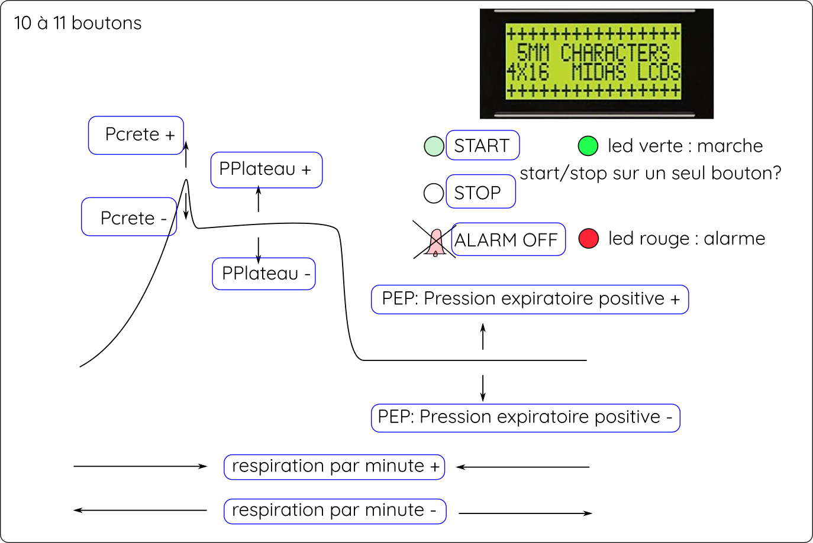

# Proto B

2020/03/25

## Requirements

- simpler calibration process: no amplification.
- only one 12V input : allow battery
- low noise : clean separation of power supply of the sensor, no ground loops, use of external ADC reference.
- able to drive the blower
- powerfull alarm buzzer
- no surface mount components
- components available and in stock in both Farnell and Radiospares.
- safety: not mandatory to have 60601, 60950-1 is enough

## Schematic

See [pdf file](./covid-respirator-ProtoB.pdf)

## Bill Of Material

### Power supply

13.8v output to ensure a slow floating charge of a 12V lead battery:
- RS: 740-5001
- RS: 161-8267  (10A version, dangerous for battery)

### Battery
Lead battery, 7Ah.
- RS: 537-5488

### Fuse
A 7Ah 12V lead battery has enough power to harm anyone. A fuse is necessary.
10A value needs to be confirmed after blower motor will be choosen.

10A (slow fuse).
- RS: 563-429

### Fuse holder:
- RS  344-5642
- Farnell 1154859

### Sensor: 

Medical specification : `Plateau pressure should be adjusted to achieve volume and be limited
to 35 cmH2O by default. It is acceptable if an option to increase this to
70 cmH2O in exceptional circumstances is provided`
> The 1psi (69mbar, 7kPa, 703mmH2O, 27inchH2O) range is perfect.

See this comparison table of different sensors with availability around major suppliers : [google doc link](https://docs.google.com/spreadsheets/d/1qR-S2XOJmOITaHZXnXCGtpi7E2upIdV9PGvASUbvRIo/edit?usp=sharing)

[MPXV5010DP](https://www.nxp.com/docs/en/data-sheet/MPX5010.pdf) : Good range, 5% accuracy (not so good), **available for mass production**. Easy to read analog output.

[NXP MPX5010DP](https://www.nxp.com/docs/en/data-sheet/MPX5010.pdf) : Not a very good accuracy, easy to read analog output.
- RS: 719-1080
- Farnell: 1555605

[Honeywell HSCSAAN001PDAA5](https://sensing.honeywell.com/honeywell-sensing-trustability-hsc-series-high-accuracy-board-mount-pressure-sensors-50099148-a-en.pdf) : Best one. Accurate, easy to read analog output. **But only available on Farnell**.
- Farnell : 1823226

### Power Supply:
Battery size will be choosen once the blower will choosen. Any 12V lead battery can do the job, ~5Ah minimum. 

### Mains supply:
This is a battery charger. It must be able to charge the battery and keep it floating at around 13.6Volts. A good 13.8 V fixed power supply can do the job.

### Blower driver:
Arduino can drive the blower through a robust low side mosfet :

VNP35N07-E
- RS: 809-1310
- Farnell : 1739428

Blower motor may be a RC motor controlled by the arduino. **TO BE DEFINED**.

### Battery voltage feedback:
The arduino is able to monitor battery voltage and raise alarm if the voltage goes under 12.7V (mains loss). This is a simple voltage divider.

### Arduino and servo power supply:
Buck regulator that can support a wide input range:
- RS: 144-6290
- Farnell : 2760747
This could be replaced by another one easily (5V 1A output)

### Buzzer:
Powerfull Buzzer, fixed tone, electronics integrated. Just need to power it, directly with 12V supply. BC548 can be replaced by any NPN transistor that support 30V/100mA.

KXG1212CL
- RS: 771-6960
- Farnell : 2215083

BC548
- RS : 796-9713
- Farnell : 2453793

Note : R6 may be connected to +12V to power the alarm if the arduino fails. Monitoring Arduino with an external watchdog need to be discussed in ProtoC.

### Sensor supply:
In order to minimize the measure noise, the sensor has a dedicated linear regulator (7805), a bit of power filtering, a little low pass filter (R5 C4).

> The ground must come from the arduino, not from other part of the circuit.

> The sensor circuit board and power supply must be isolated from other components, and really close to the arduino. Ideally, less than 4cm of 1mm² wire.

L7805CV-DG
- RS: 793-1346
- Farnell: 2849718
47uF/25V
- RS 807-3324 
- Farnell 2917904
10uF/16V
- RS 862-3083 
- Farnell 9451692
100nF/50V
- RS 133-5716 
- Farnell 2507749

